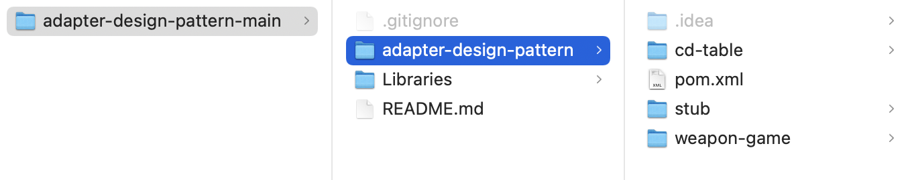
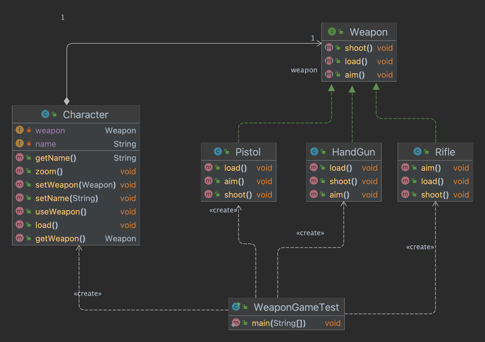
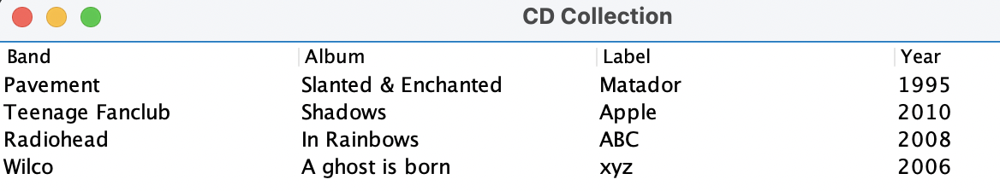

# Adapter design pattern

Repository with source code of the examples used in the classes about the design pattern Adapter, taught by Rodrigo Martins Pagliares at UNIFAL-MG.

## Examples

To ease navigating through the examples in the repo, I created a Multi Module Maven Project. In this way, all examples can be loaded and built together in a single instance of the IDE of your choice (I use IntelliJ IDEA Ultimate Edition). To open the examples in your IDE, open/import the parent project (folder highlighted in blue in the Figure).

    

### 01 - weapon-game-initial-version

This is the initial version of our weapon game. In the game, a character can use a pistol, a handgun and a rifle.  

    

### 02 - weapon-game

In this example, I demonstrate the use of the Adapter Design Pattern in order to use a third-party class in our weapon game. We don't have the source code of the third-party classs (but we have the Java doc). In addition to that, we don't want to change our Weapon interface to not break all of our classes that implement that interface. The third party class represents a ShotGun to be used by our game Character.

### 03 - cd-table

This example demonstrates how developers use the Adapter design pattern in order to adapt a domain specific interface (list of cds) to become compatible with the AbstractTableModel required by the Swing JTable component. By using the design pattern Adapter, the example shows the list of CDs in the JTable.

    

### 04 - stub

This example demonstrates the concept of Stub (empty interface implementation to ease the task of overriding interfaces methods that are not needed by a developer). The example illustrates the use of the MouseAdapter stub class, part of the Java SE Swing library. 

As we can see form the name, MouseAdapter is an implementation of the design pattern adapter in the sense that it adapts the interface of an interface to  MouseAdapter interface that can be inherited by a domain specific class, overriding only the methods needed.

Although Java SE developers named the class MouseAdapter, some people prefer to see it as a implementation of the Facade design pattern.
